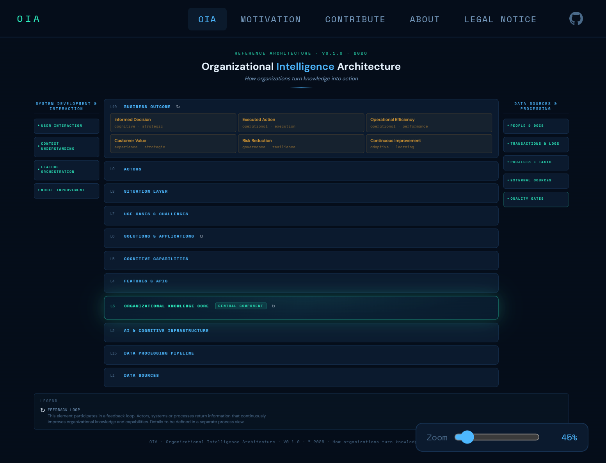

# Organizational Intelligence Architecture (OIA)

> *How organizations turn knowledge into action.*

**[Live Demo →](https://rukurz.github.io/oi-architecture/)**

**Organizational Intelligence Architecture (OIA)** is a conceptual reference model for intelligent organizations.
It describes how raw data becomes decisions, actions, and measurable business outcomes — going beyond pure data and analytics architectures.

```text
Data → Intelligence → Capability → Solution → Business Outcome
```

**Status:** Version 0.1.0 – early access, designed as a thinking tool.
Further development — from reference architecture to reference implementation — is intended to happen together with a community.



---

## At a Glance

OIA is aimed at **enterprise and solution architects, strategic decision-makers, and AI leaders** who want to establish a shared language for:

- data, knowledge, and decisions
- AI/LLM infrastructure
- concrete solutions and business outcomes

The model is available as an interactive visualization:
a multi-layer diagram that shows the situations, use cases, capabilities, solutions, AI infrastructure, and data foundation of an organization in a single coherent picture.

---

## Why OIA?

The central thesis of OIA:

> Organizations fail at AI adoption when they do not first address data quality, culture, structures, and knowledge curation.

Typical architecture maps today stop at:

- data platforms and pipelines
- analytics and BI systems
- isolated AI/ML use cases

What is missing is an **architectural bridge**:

- from "we have data"
- through "we have explicit, validated capabilities"
- to "we consistently apply those capabilities in solutions and decisions"

OIA makes this path explicit — as the **cognitive architecture of the organization**.

---

## Architecture Layers

### Core Layers

| Layer                            | What it describes                                                                              |
|----------------------------------|-----------------------------------------------------------------------------------------------|
| **Situation Layer**              | Context of every decision: employee, event, time, place, domain, task, permissions            |
| **Use Cases**                    | Organizational challenges: e.g. HR, Maintenance, Customer Support                             |
| **Solutions & Applications**     | User-facing systems: Enterprise Search, Knowledge Assistants, Code Assist                     |
| **Cognitive Capabilities**       | What the organization *can do*: Find, Link, Evaluate, Generate, Structure, Report             |
| **Features & APIs**              | Reusable services: `/search` `/summarize` `/link` `/chat` `/classify`                        |
| **AI & Cognitive Infrastructure**| LLMs, ML, NLP, Vector Indexes, Knowledge Graphs, RPA                                         |
| **Data Layer**                   | Foundation: persons, documents, projects, rules + processing pipeline                         |

### Cross-Cutting Dimensions

- **Left side — System Development & Interaction**
  User Interaction, Context Understanding, Feature Orchestration, Learning & Optimization.

- **Right side — Data Sources & Processing**
  Ingestion → Processing → Cleaning → Validation.

---

## Quick Start (Dev, v0.1.0)

Goal: a running dev environment and your first small change in **under 20 minutes**.

### Prerequisites

- **Node.js 20+** — <https://nodejs.org>
- **Git**
- **VS Code** (recommended) — install the suggested extensions

### 1 — Clone and install

```bash
git clone https://github.com/ruKurz/oi-architecture.git
cd oi-architecture/oia-site
npm install
```

### 2 — Start the dev server

```bash
npm run dev
# → http://localhost:5173/oi-architecture/
```

Open the browser — hot reload is active.

### 3 — Run tests

```bash
npm test
# All tests must stay green after your changes
```

---

## Making Changes

### 4 — Find the right place

| What you want to change                   | Where to look                             |
|-------------------------------------------|-------------------------------------------|
| OIA model (layers, items, labels)         | `oia-site/src/data/oia-model.json`        |
| Layer rendering                           | `oia-site/src/renderer/render-layer.ts`   |
| Detail / side panel                       | `oia-site/src/renderer/render-panel.ts`   |
| Navigation & routing                      | `oia-site/src/router.ts`                  |
| Pages (Motivation, About, ...)            | `oia-site/src/views/`                     |
| Colors, layout, design tokens             | `oia-site/src/styles/`                    |
| Constants & zoom levels                   | `oia-site/src/constants.ts`               |

### 5 — Implement your change

Before you start:

- Read [`CONVENTIONS.md`](CONVENTIONS.md) — naming, BIZ/DEV separation, commit format.
- Every commit references a GitHub Issue:
  `feat(renderer): add X  Refs #N`

After your change:

```bash
npm run lint && npm test
```

Both must pass before you commit.

### 6 — Open a Pull Request

1. Fork the repo.
2. Create a feature branch:
   `git checkout -b feat/your-change`
3. Commit using [Conventional Commits](CONVENTIONS.md#23-conventional-commits).
4. Push and open a Pull Request — CI checks lint, tests, and build.

Full details: [`docs/CONTRIBUTING.md`](docs/CONTRIBUTING.md).

---

## Documentation

| Document | Purpose |
|---|---|
| [`docs/CONTRIBUTING.md`](docs/CONTRIBUTING.md) | Contribution workflow, dev setup, commit format, PR process |
| [`docs/ARCHITECTURE.md`](docs/ARCHITECTURE.md) | Codebase structure, rendering architecture, routing, CSS |
| [`docs/MODEL_GUIDE.md`](docs/MODEL_GUIDE.md) | OIA model layers, terminology, how to contribute to the model |
| [`docs/GOOD_FIRST_ISSUES.md`](docs/GOOD_FIRST_ISSUES.md) | Curated entry points for new contributors |
| [`decisions/`](decisions/) | Architecture Decision Records |

---

## Optional AI Tooling (Claude Code)

The project ships a set of ready-made prompts for recurring tasks. These are entirely optional — contributors do not need them to work on the codebase. They are provided as a convenience for those who use [Claude](https://claude.ai) or Claude Code and want structured starting points for common activities.

Each prompt is self-contained. If you use one, read its `## Kontext` section first.

| Prompt                                   | Purpose                                              |
|------------------------------------------|------------------------------------------------------|
| `prompts/development/project-review.md`  | Project health check, generates GitHub Issues        |
| `prompts/development/sprint-retro.md`    | Sprint Review → Retro → Planning                     |
| `prompts/development/create-adr.md`      | Create new Architecture Decision Records             |
| `prompts/development/create-issue.md`    | Generate structured GitHub Issues                    |
| `prompts/development/evolve-model.md`    | Extend or refine the OIA model                       |
| `prompts/templates/prompt-helper.md`     | **Required** before creating new prompts             |

---

## Understanding the Architecture (Without Code)

If you want to **understand and use** the model without necessarily contributing to the codebase:

- `context/oia-context.md` — stable context anchor summarizing the current model state.
- Articles:
  - `articles/organizational-intelligence-architecture.md` — introduction to OIA.
  - `articles/the-organizational-brain.md` — the perspective of "the organization as a cognitive system".
- Load `context/oia-project-instruction-prompt.md` into a Claude project to get a configured architecture sparring partner.

---

## Repository Structure

```text
oi-architecture/
├── oia-site/          # Interactive renderer (TypeScript + Vite)
│   └── src/
│       ├── data/      # oia-model.json — single source of truth for the model
│       ├── renderer/  # Layer, panel, diagram rendering logic
│       ├── views/     # Site pages (Motivation, About, …)
│       └── styles/    # CSS design tokens and layout
├── context/           # Stable context documents (project anchor)
├── articles/          # Published and draft LinkedIn articles
├── diagrams/          # Architecture diagrams (HTML/SVG)
├── decisions/         # Architecture Decision Records (ADRs)
├── prompts/           # Claude prompts for recurring project tasks
│   ├── development/   # Execution prompts (review, sprint, ADR, …)
│   ├── diagrams/      # Diagram generation prompts
│   └── templates/     # Prompt helper (mandatory for new prompts)
├── notes/             # Research notes and ideas
├── images/            # Visual assets
└── inspirations/      # Reference material and external sources
```

---

## Current Status

**V1** — The conceptual 7-layer architecture is defined and published.
**V2 (in progress)** — Focus areas:

| Item                                                                                      | Priority |
|-------------------------------------------------------------------------------------------|----------|
| Knowledge Core — central knowledge store (Semantic Layer, Index, Access Control, Graph)   | 🔴 High  |
| Clear data flow: Pipeline → Knowledge Core → Capabilities                                 | 🔴 High  |
| Actors — explicit modeling of humans and agents                                            | 🟡 Medium |
| Business Outcome — closing the loop at Decision / Action / Outcome                        | 🟡 Medium |
| Validated Knowledge Storage — explicit layer for curated, versioned knowledge             | 🟠 Medium |

---

## Key Terminology

- **OIA** — Organizational Intelligence Architecture (not: Operational Intelligence).
- **Knowledge Core** — the organization's central, structured knowledge store.
- **Cognitive Capabilities** — what the system *can do*, independent of the technical implementation.
- **Solutions** — user-facing applications, not technology stacks.
- **Situation Layer** — context input, not a user interface.

---

## Strategic Context & Community

OIA bridges the gap between:

- code-driven AI and established enterprise data landscapes
- technology enthusiasm and organizational prerequisites
- technical architecture and strategic perspective

This repository is **Version 0.1.0** — deliberately designed as a starting point for discussion.
Further development toward reference implementations is intended to happen together with a community:

- feedback on the model and visualization
- new use cases and capabilities
- shared experiments with Knowledge Cores, agents, and existing enterprise systems


---

## License

Dual Licensing:

- **Code** (`oia-site/`) — [MIT License](LICENSE)
- **Content** (`context/`, `articles/`, `diagrams/`, `decisions/`, `notes/`) — [CC BY 4.0](LICENSE-CC-BY-4.0)

---

## Conventions

Binding rules for naming, commits, and BIZ/DEV separation: [`CONVENTIONS.md`](CONVENTIONS.md).
Architecture Decision Records: [`decisions/`](decisions/).

---

## History

The OIA model went through several visual iterations before the current data-driven renderer was built.

| Version | Artifact | Description |
|---|---|---|
| V1 | [images/oia-model-v1.png](images/oia-model-v1.png) | First static diagram — establishes the 7-layer structure |
| V2 pre | [diagrams/oia-diagram-v2.html](diagrams/oia-diagram-v2.html) | Interactive HTML prototype — the design language of the renderer |
| V2 | `oia-site/` | Production renderer: TypeScript + Vite, fully data-driven from `oia-model.json` |

> A diagram gallery showing the visual evolution of OIA is planned for the microsite.
